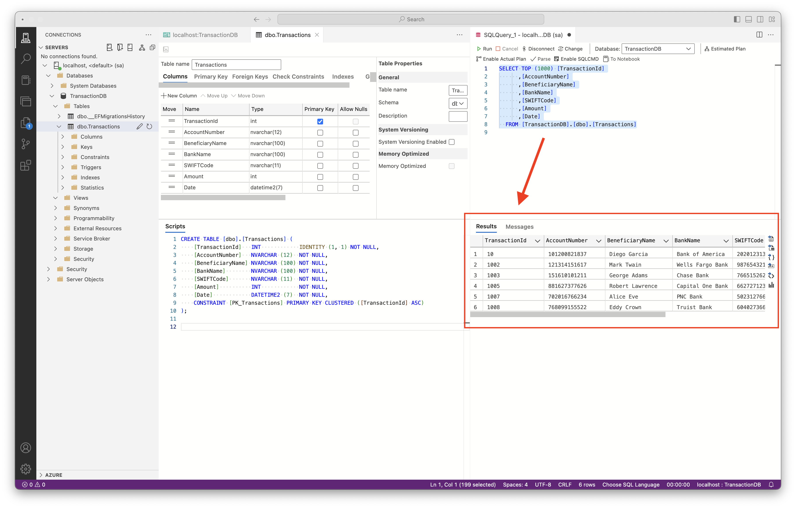
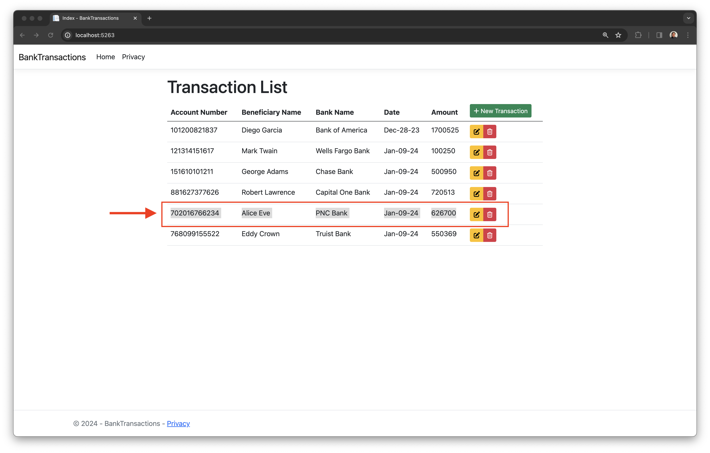
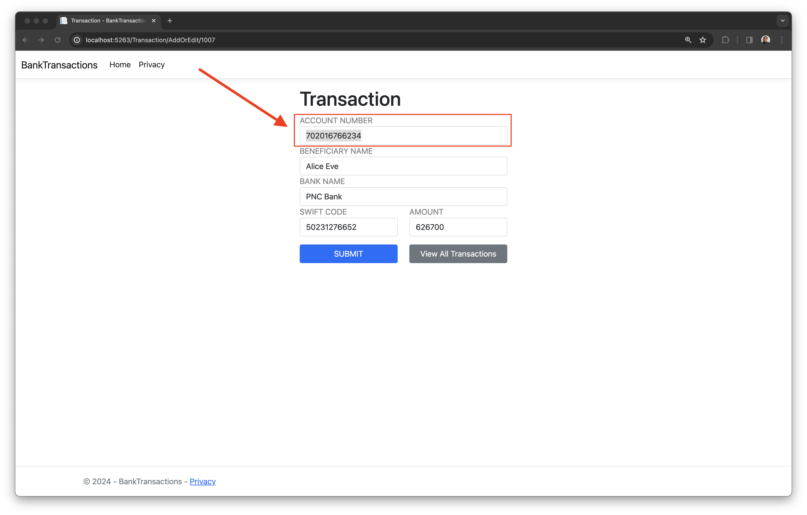
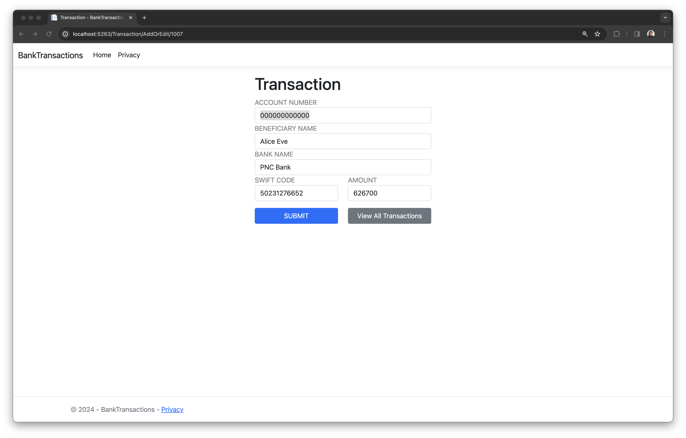
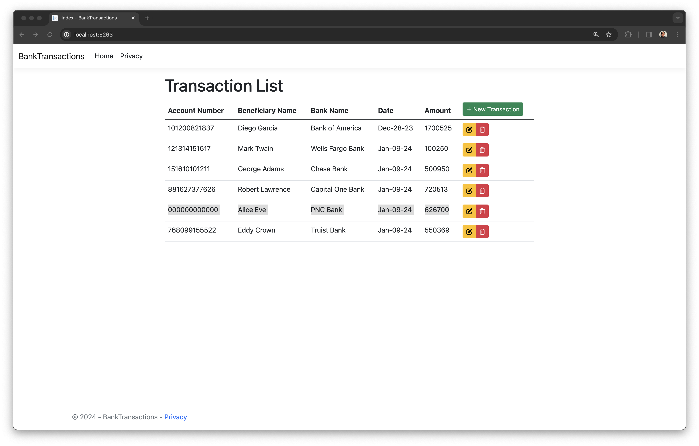
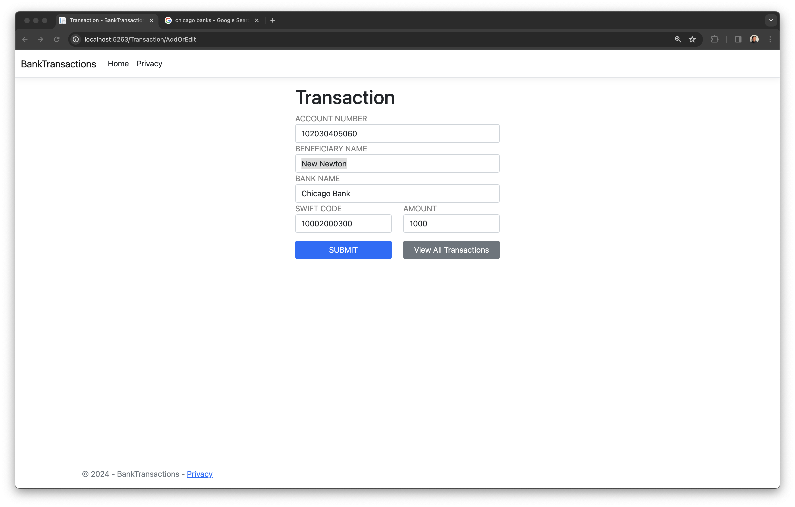
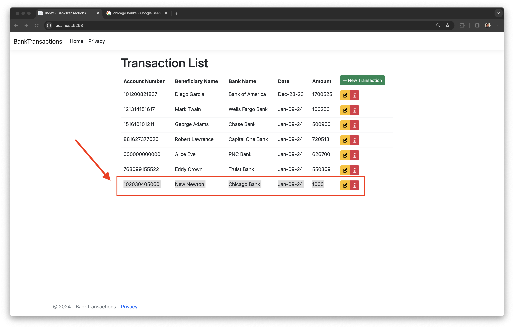

# BankTransactions Asp.Net App

---
## Overview

This project demonstrates CRUD (Create, Read, Update, Delete) operations in an ASP.NET Core MVC application using Entity Framework Core.

### Technologies Used

* **ASP.NET Core MVC:** 
    * Utilized for crafting the web application using the MVC design pattern, ensuring a clean separation of concerns and enhanced maintainability.
* **Entity Framework Core:** 
    * Employed for efficient Object-Relational Mapping, enabling seamless interactions between the application and the SQL database.
* **Azure SQL Edge (Docker Container):** 
    * Integrated a high-performance, scalable SQL database using Docker.
* **Bootstrap & FontAwesome:** 
    * Enhanced the user interface with responsive design and visually appealing icons.
* **Visual Studio 2022:** 
    * IDE used, leveraging its comprehensive suite of tools for .NET development.

### Architecture

* **Model-View-Controller (MVC):** 
    * The application follows the MVC architectural pattern.
* **Entity Framework Core DB First Approach:** 
    * Directly mapped the database schema to the business domain entities, resulting in a database-driven application design.
* **Dependency Injection:** 
    * Leveraged built-in dependency injection in ASP.NET Core for managing services and database context, ensuring loose coupling and testability.

### Methodologies

* **CRUD Operations:** 
    * Implementation of basic database operations: Create, Read, Update, Delete.
* **Dependency Injection:** 
    * Used extensively for managing services and database context.
* **Data Annotations:** 
    * Used for model validation and database schema configuration.
* **Client-side and Server-side Validation:** 
    * Ensuring data integrity both on the client and server sides.

## App Demo

* **...** 

* **...** 

* **...**

* **....**

* **...**

* **...**

* **..."**

* **...**

* **...**

* **..."**

---
## Discussion

* **...**

....

* **...**

...